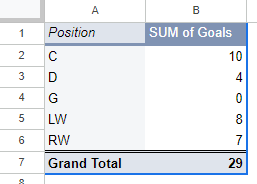
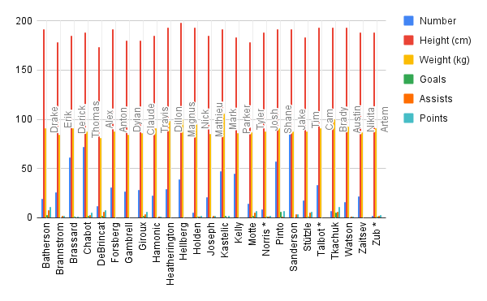

**Date**<br>
**Cote et nom du cours**<br>
**Prénom et nom de l'étudiant(e)**<br>
**Présenté à Jean-Sébastien Marier**<br>

# Projet de mi-session : Analyse exploratoire de données (AED)

Utilisez un croisillon (`#`) pour créer un intertitre de niveau 1 comme celui-ci.

## Avant-propos

Pour ce travail, vous devez extraire des données d’un site Internet ou d’une base de données. Vous devez ensuite nettoyer et analyser votre jeu de données, trouver une histoire potentielle et créer une visualisation. Votre travail doit clairement expliquer votre processus. Vous devez écrire environ 1500 à 2000 mots et inclure des captures d’écran montrant les différentes étapes de votre analyse. Votre travail doit être rédigé avec le format Markdown et être publié sur GitHub.

J'assigne différentes versions de ce projet à mes étudiants en journalisme numérique et en « data storytelling » depuis déjà quelques années. La structure générale de ce travail est basée sur celle du [*Guide du datajournalisme*](http://jplusplus.github.io/guide-du-datajournalisme/index.html). La présente version est également inspirée du programme [Key Capabilities in Data Science](https://extendedlearning.ubc.ca/programs/key-capabilities-data-science) offert par l'Université de la Colombie-Britannique (UBC).

**Voici quelques ressources utiles pour ce travail :**

* [Page *Syntaxe de base pour l’écriture et la mise en forme* de GitHub](https://docs.github.com/fr/get-started/writing-on-github/getting-started-with-writing-and-formatting-on-github/basic-writing-and-formatting-syntax)
* [Le répertoire modèle pour ce projet au cas où vous effaceriez quelque chose par accident](https://github.com/jsmarier/jou4100_jou4500_mpad2003_project2_template)

Avez-vous remarqué comment créer un hyperlien? En langage Markdown, on met le texte cliquable entre une paire de crochets et l'adresse URL entre parenthèses.

Pour créer une liste non ordonnée, il suffit de mettre une étoile (`*`) devant chaque item.

## 1. Introduction

Insérez votre texte ici.

## 2. Obtenir les données

Utilisez deux croisillons (`##`) pour créer un intertitre de niveau 2 comme celui-ci.

Utilisez le modèle de code ci-dessous pour insérer une capture d'écran. Vos images doivent être sauvegardées dans le même dossier que votre fichier `.md`.

<br>
*Figure 1 : La fenêtre d'importation d'un fichier de Google Feuilles de calcul.*

**Voici quelques exemples de fonctions et de lignes de code mises dans des boîtes grises :**

1. Si vous nommez une fonction, mettez là à l'intérieur de guillemets « inclinés » comme ceci : `IMPORTHTML`.
1. Si vous voulez inclure une ligne de code complète, faites la même chose, mais avec tout le code : `=IMPORTHTML("https://en.wikipedia.org/wiki/China"; "table", 5)`.
1. Alternativement, vous pouvez mettre le code dans une boîte indépendante en utilisant le modèle de code ci-dessous :

``` r
=IMPORTHTML("https://en.wikipedia.org/wiki/China"; "table", 5)
```
C'est aussi comme ça qu'on crée une liste ordonnée. Il suffit de mettre `1.` devant chaque item.

## 3. Comprendre les données

### 3.1. Analyse VIMA

Utilisez trois croisillons (`###`) pour créer un intertitre de niveau 3 comme celui-ci. Je vous prie de suivre ce modèle en ce qui a trait aux intertitres de niveaux 1 et 2. Toutefois, je vous laisse le loisir d'utiliser les intertitres de niveau 3 comme bon vous semble.

Insérez votre texte ici.

Appuyez vos affirmations en citant les sources appropriées. Veuillez suivre les [normes APA en matière d'attribution dans le corps du texte](https://apastyle.apa.org/style-grammar-guidelines/citations).

**Par exemple :**

Comme l'affirme Cairo (2016), une visualisation de données doit être véridique...

### 3.2. Nettoyage des données

Insérez votre texte ici.

### 3.3. Analyse exploratoire des données (AED)

Insérez votre texte ici.

**Cette section doit inclure une capture d'écran de votre tableau croisé dynamique, comme ceci :**

<br>
*Figure 2 : Ce tableau croisé dynamique montre...*

**Cette section doit aussi inclure une capture d'écran de votre graphique exploratoire, comme ceci :**

<br>
*Figure 3 : Ce graphique exploratoire montre...*

## 4. Récit potentiel

Insérez votre texte ici.

## 5. Conclusion

Insérez votre texte ici.

## 6. Références

Veuillez inclure une liste de vos références ici. Assurez-vous de suivre les [normes APA pour les références](https://apastyle.apa.org/style-grammar-guidelines/references). Les retraits négatifs (*hanging paragraphs*) ne sont pas nécessaires. Le [guide sur l'adaptation APA](https://arts.uottawa.ca/lettres/sites/arts.uottawa.ca.lettres/files/cartu-outils-de-redaction-adaptation-apa.pdf) de l'Université d'Ottawa pourrait également vous être utile.

**Voici un exemple :**

Bounegru, L., & Gray, J. (Eds.). (2021). *The Data Journalism Handbook 2: Towards A Critical Data Practice*. Amsterdam University Press. [https://ocul-crl.primo.exlibrisgroup.com/permalink/01OCUL_CRL/hgdufh/alma991022890087305153](https://ocul-crl.primo.exlibrisgroup.com/permalink/01OCUL_CRL/hgdufh/alma991022890087305153)
